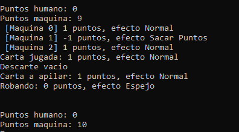
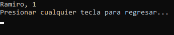
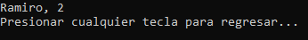

## Verificaciones con diferentes lotes de prueba

#### Caso 1

| Descripción                                                                                                                                           | Salida Esperada          | Salida Obtenida                                          |
| :---------------------------------------------------------------------------------------------------------------------------------------------------- | :----------------------- | :------------------------------------------------------- |
| `Se quiere probar que es lo que pasaria si: la ia cuando esta cerca de ganar en dificil (8-9 puntos) y tiene una carta positiva en la mano, la tira.` | `Tire la carta positiva` |  |

#### Caso 2

| Descripción                                                                               | Salida Esperada                | Salida Obtenida                                                                                                                     |
| :---------------------------------------------------------------------------------------- | :----------------------------- | :---------------------------------------------------------------------------------------------------------------------------------- |
| `Se quiere probar que es lo q pasaria si: luego de una partida, se actualiza el ranking.` | `que si actualice el ranking ` |   |

#### Caso 3

| Descripción                                                                                       | Salida Esperada                                                              | Salida Obtenida                                                                                                                     |
| :------------------------------------------------------------------------------------------------ | :--------------------------------------------------------------------------- | :---------------------------------------------------------------------------------------------------------------------------------- |
| `Se quiere probar que es lo q pasaria si: se juega la carta espejo cuando se recibe un negativo.` | `se vuelve a sumar los puntos sacados, y se le aplica el efecto al oponente` |   |

### Caso 4

| Descripción                                                                                                                   | Salida Esperada                                       | Salida Obtenida                                          |
| :---------------------------------------------------------------------------------------------------------------------------- | :---------------------------------------------------- | :------------------------------------------------------- |
| `Se quiere probar que es lo q pasaria si: se juega repetir turno, que se agarre otra carta  y pueda volver a tirar negativo.` | `2 turnos consecutivos del jugador que tiro la carta` |  |

### Caso 5

| Descripción                                                                                                                       | Salida Esperada                          | Salida Obtenida                                          |
| :-------------------------------------------------------------------------------------------------------------------------------- | :--------------------------------------- | :------------------------------------------------------- |
| `Se quiere probar que es lo q pasaria si: Si la ia recibe un negativo en dificil, prioriza tirar un espejo (Si es que lo tiene).` | `tira un espejo hacia la carta negativa` |  |

### Caso 6

| Descripción                                                                                                                                             | Salida Esperada                         | Salida Obtenida                                          |
| :------------------------------------------------------------------------------------------------------------------------------------------------------ | :-------------------------------------- | :------------------------------------------------------- |
| `Se quiere probar que es lo q pasaria si: Si el humano esta cerca de ganar en dificil(8-9 puntos) que la ia priorice jugar una carta que resta puntos.` | `la ia tira una carta que reste puntos` |  |

### Caso 7

| Descripción                                                                                                                 | Salida Esperada                      | Salida Obtenida                                          |
| :-------------------------------------------------------------------------------------------------------------------------- | :----------------------------------- | :------------------------------------------------------- |
| `Se quiere probar que es lo q pasaria si: al restarle los puntos a algun jugador diese negativo, el puntaje se quede en 0.` | `que el puntaje sea 0 y no negativo` |  |

### Caso 8

| Descripción                                                             | Salida Esperada                                                                          | Salida Obtenida                                          |
| :---------------------------------------------------------------------- | :--------------------------------------------------------------------------------------- | :------------------------------------------------------- |
| `Se quiere probar que es lo q pasaria si: Se queda sin cartas el mazo.` | `El mazo se reconstruye automáticamente con las cartas descartadas y el juego continúa.` |  |

### Caso 9

| Descripción                                                                 | Salida Esperada                              | Salida Obtenida                                          |
| :-------------------------------------------------------------------------- | :------------------------------------------- | :------------------------------------------------------- |
| `Se quiere probar que es lo q pasaria si: se alcanzan los 12 puntos o mas.` | `El jugador gana la partida al alcanzar 12.` |  |
